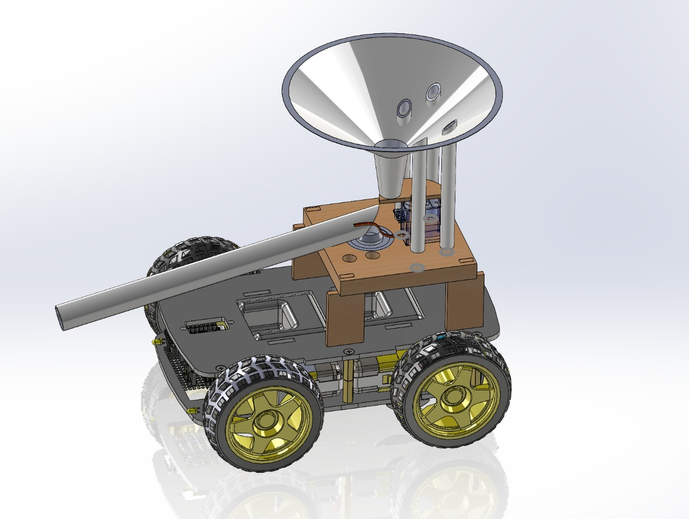

# Pot-Hole-filling-robot

## Introduction
Potholes are a significant issue faced by drivers worldwide, impacting both vehicles and pedestrians. Repairing potholes is time-consuming and labor-intensive. To address this, we've developed a pothole filling robot that aids workers in efficient repairs without replacing their jobs. This project was a collaborative effort by the members of Rotonity, the robotics club.

## Hardware Design
The pothole filling robot's hardware includes:
- Raspberry Pi 4B microprocessor for control
- Two servo motors for gravel mix output and dispensing mechanism rotation
- Smartelex motor driver for mobility on various terrains
- Funnel-type storage unit for gravel mix
- Sturdy metal chassis and L clamps for durability

## Software Design
The Raspberry Pi 4B microprocessor is programmed to:
- Control robot movements
- Manage gravel mix dispensing
- Rotate the dispensing mechanism
The robot is operated via Wi-Fi from a laptop or computer.

## Working
The pothole filling process involves:
1. The worker operates the robot remotely via Wi-Fi, driving it to the pothole site.
2. The robot's mobility allows it to navigate various terrains with ease.
3. The servo motor opens the gravel mix output, and a cup and PVC pipe dispense the mix.
4. The dispensing mechanism rotates 180 degrees, enabling pothole filling on both road sides.
5. The worker closes the gravel mix output using the servo motor mechanism.

## Raspberry Pi Code
Check out the [RpiCode.py](RpiCode.py) file for the Raspberry Pi code that controls the robot.

## Robot Design
Here's an image of the robot's design:

## Working Prototype
Below is an image of the robot prototype:

